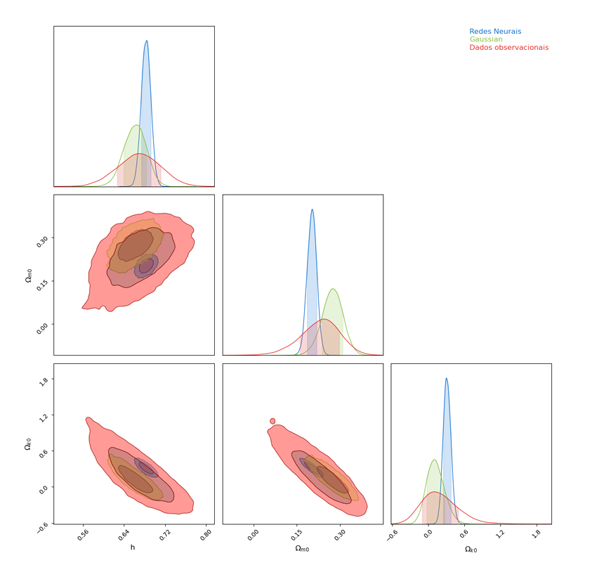
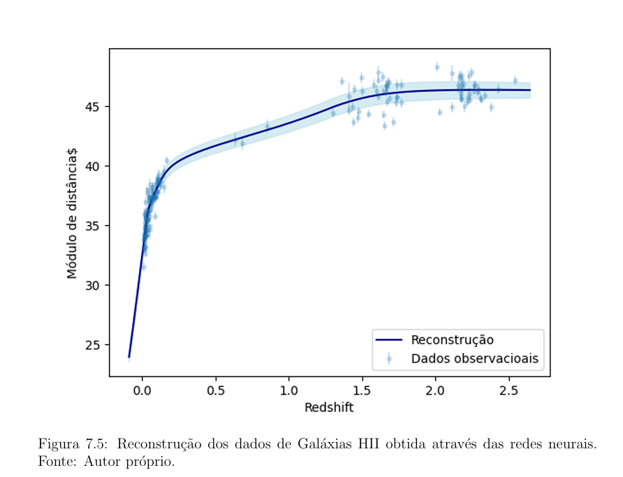

# Probabilistic Machine Learning Thesis  
**Neural Networks, Gaussian Processes and Bayesian Inference for real-world data modeling**

This repository presents my Bachelor's thesis, focused on building a **probabilistic machine learning pipeline** to model, reconstruct and analyze **real, noisy datasets** using **Neural Networks, Gaussian Processes and Bayesian inference**.

The project was fully implemented in **Python** and follows the same modeling, validation and uncertainty estimation workflows used in **machine learning engineering, data science and AI research**.

---

## 🚀 Project Summary

The objective of this project was to extract reliable patterns and parameters from **complex observational data** using **probabilistic machine learning models**.

The pipeline includes:

- **Neural Networks** for nonlinear regression  
- **Gaussian Process Regression** for probabilistic predictions  
- **Bayesian Inference** for parameter estimation  
- **Markov Chain Monte Carlo (MCMC)** for posterior sampling  
- **Uncertainty Quantification and Model Comparison**

Although the datasets come from astrophysical observations, the methodology is fully **domain-agnostic** and directly applicable to **finance, healthcare, industrial analytics, and any real-world data problem**.

---

## 📊 Model Outputs

### 🔹 Bayesian posterior distributions (MCMC)

Final parameter estimates and their uncertainties obtained via **Bayesian inference and MCMC**.

---

### 🔹 Neural Network regression

Neural network predictions for a real observational dataset, learning a nonlinear mapping from data.

---

### 🔹 Gaussian Process regression

Gaussian Process predictions for different kernel hyperparameters, illustrating probabilistic forecasting and uncertainty-aware modeling.

---

## 🧠 Techniques and Tools

This project uses industry-relevant machine learning and data science techniques:

- **Supervised Learning (Neural Networks)**
- **Gaussian Process Regression**
- **Bayesian Modeling**
- **MCMC (Markov Chain Monte Carlo)**
- **Probabilistic Regression**
- **Uncertainty Quantification**
- **Model Validation and Comparison**
- **Python, NumPy, SciPy, ML libraries**

---

## 📄 Thesis Document

The full thesis is available here:

**`thesis.pdf`**

It contains mathematical formulation, model definitions, datasets, experiments, and detailed analysis.

---

## 🎯 Why this project matters for Machine Learning Engineering

This work demonstrates the complete **ML lifecycle**:

- Working with **noisy real-world data**  
- Designing probabilistic models  
- Training and evaluating ML models  
- Quantifying prediction uncertainty  
- Interpreting results for decision making  

These are core skills required for **Machine Learning Engineers, Data Scientists and AI Engineers**.

---

## 👤 Author

**Kevin Mota da Costa**  
Machine Learning • Bayesian Modeling • Data Science
