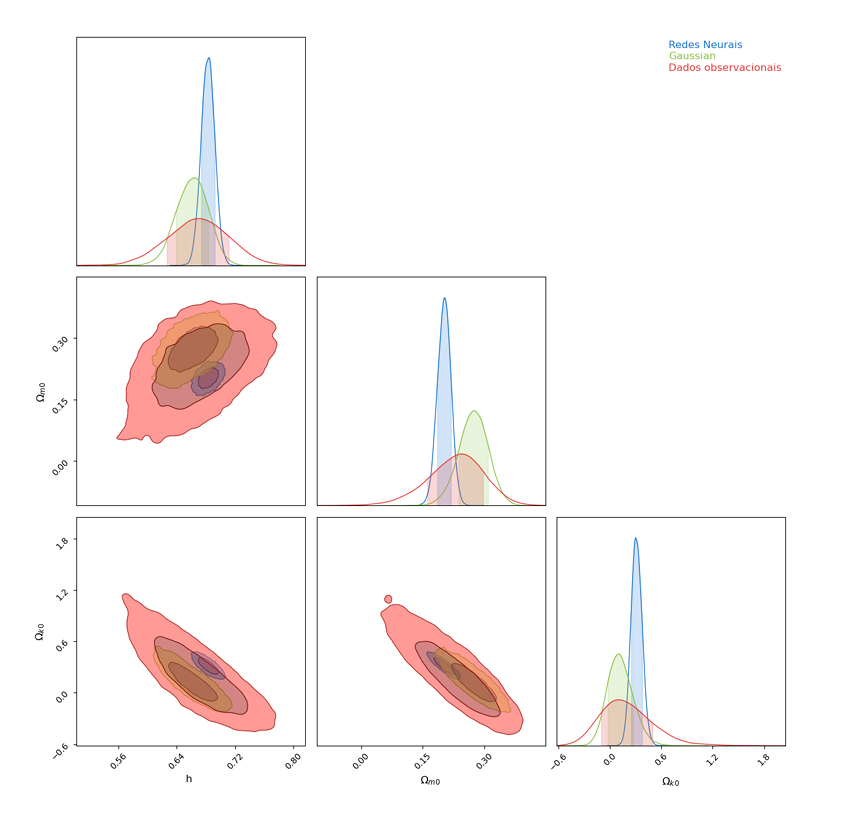
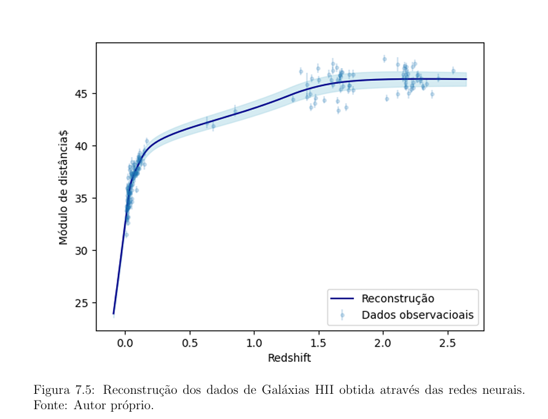
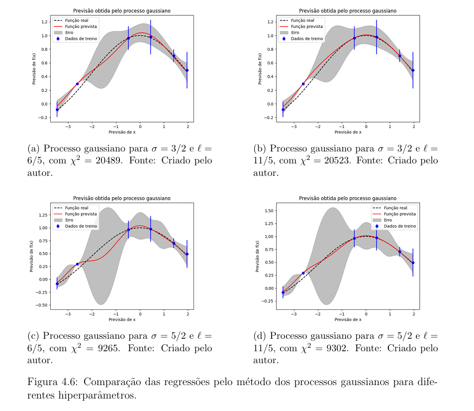

# 🎓 Probabilistic Machine Learning Thesis

**Neural Networks, Gaussian Processes and Bayesian Inference for Real-World Data Modeling**

This repository contains my Bachelor's thesis, focused on designing and implementing a complete probabilistic machine learning pipeline for modeling complex, noisy real-world datasets.

The project integrates neural networks, Gaussian processes, Bayesian inference, and MCMC sampling within a unified statistical framework.

Author: Kevin Mota da Costa
Portfolio: [https://costakevinn.github.io](https://costakevinn.github.io)
LinkedIn: [https://linkedin.com/in/SEUUSER](https://linkedin.com/in/SEUUSER)

---

## 🎯 Project Objective

The objective of this work was to extract reliable patterns and parameter estimates from observational data under uncertainty.

The system was designed to:

* Model nonlinear relationships
* Quantify predictive uncertainty
* Estimate posterior parameter distributions
* Compare probabilistic models
* Validate results using statistical diagnostics

Although the dataset originates from astrophysical observations, the methodology is domain-agnostic and directly applicable to finance, healthcare, industrial analytics, and any real-world data problem involving uncertainty.

---

## 🧠 Modeling Framework

The thesis integrates multiple probabilistic approaches within a structured ML workflow:

### 1️⃣ Neural Networks

* Nonlinear regression modeling
* Implemented using PyTorch and TensorFlow/Keras
* Gradient-based optimization
* Model validation and performance comparison

### 2️⃣ Gaussian Process Regression

* Non-parametric Bayesian regression
* Kernel-based modeling
* Predictive mean and confidence intervals
* Hyperparameter tuning and kernel comparison

### 3️⃣ Bayesian Inference

* Likelihood-based parameter estimation
* Prior specification and posterior updating
* Statistical model comparison

### 4️⃣ MCMC (Markov Chain Monte Carlo)

* Posterior sampling
* Convergence diagnostics
* Uncertainty propagation across parameters

Together, these components form a complete probabilistic machine learning pipeline.

---

## 📊 Model Outputs

### 🔹 Bayesian Posterior Distributions (MCMC)

Posterior parameter estimates and uncertainty intervals obtained via Bayesian inference:

---

### 🔹 Neural Network Regression

Nonlinear regression applied to real observational data:

---

### 🔹 Gaussian Process Regression

Kernel-based probabilistic forecasting with uncertainty bands:

---

## 🔬 Capabilities Demonstrated

* Modeling noisy real-world datasets
* Designing probabilistic regression systems
* Likelihood-based model training
* Bayesian posterior computation
* MCMC sampling and diagnostics
* Uncertainty quantification
* Model validation and comparison
* Interpretation of statistical outputs for decision-making

---

## 📈 Engineering Perspective

Beyond theoretical modeling, this project demonstrates:

* Structured experimentation workflow
* Reproducible statistical analysis
* Comparison between neural and Bayesian approaches
* Numerical stability considerations
* Clear separation between modeling, inference, and diagnostics

This reflects principles used in real-world machine learning engineering and applied data science.

---

## 🛠 Tech Stack

### Programming

Python

### Scientific Computing

* NumPy
* SciPy
* Pandas

### Machine Learning

* PyTorch
* TensorFlow
* Keras
* Scikit-learn

### Visualization

* Matplotlib

### Probabilistic Methods

* Bayesian inference
* MCMC sampling
* Gaussian Processes

---

## 📄 Thesis Document

The full thesis is available in:

`thesis.pdf`
(Document written in Portuguese)

It contains:

* Mathematical formulation
* Model definitions
* Dataset description
* Experimental results
* Detailed statistical analysis

---

## 🌐 Portfolio

This project is part of my Machine Learning portfolio:
👉 [https://costakevinn.github.io](https://costakevinn.github.io)

---

## 👤 Author

Kevin Mota da Costa
Machine Learning • Bayesian Modeling • Data Systems
